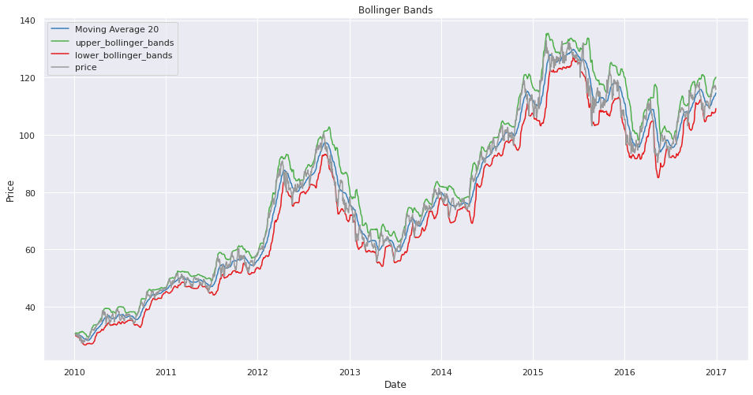
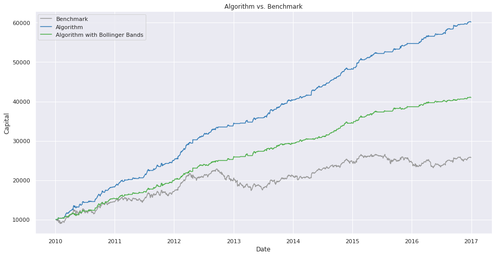

### Buy and sell strategy: MA-20
### Risk Control Method: Bollinger Bands

1. Import libs and stock info files
2. Run this to get results (use AAPL as an example)
```
company = nyse[nyse['symbol'] == 'AAPL'].set_index('date')
company, signals = run_strategy(company)
bollinger_bands_visualization(company, signals=signals) # show bollinger_bands
trading_visualization(company, signals=signals) # show when to trade
return_visualization(company, signals=signals) # show the final return
show_final_return_results(signals=signals) # show the numerical final return
show_sharpe_ratio_results(signals=signals) # show the sharpe ratio
```




