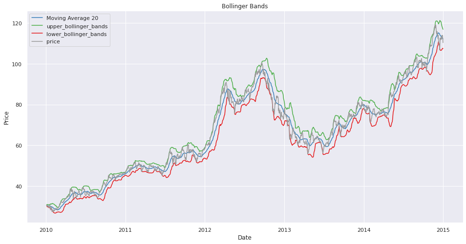
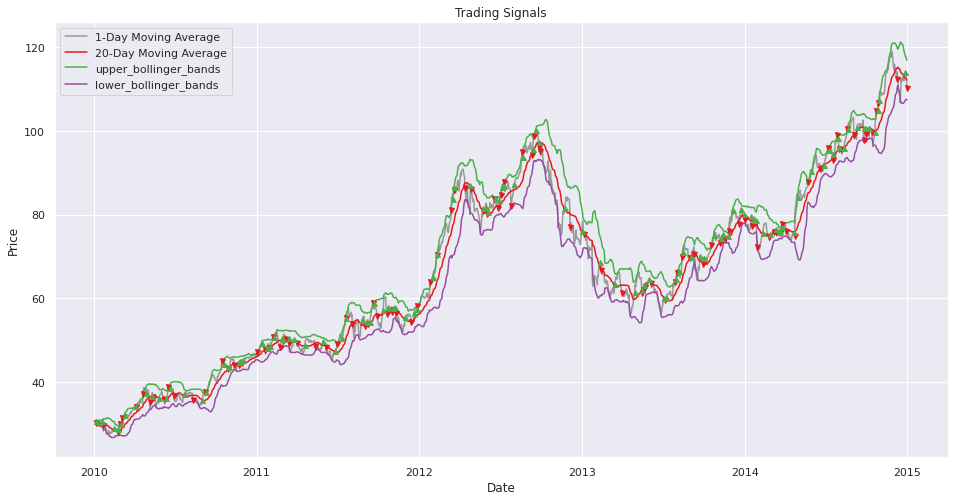
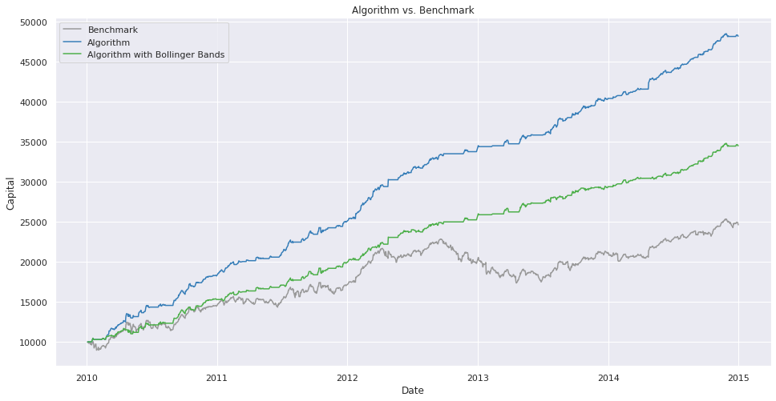
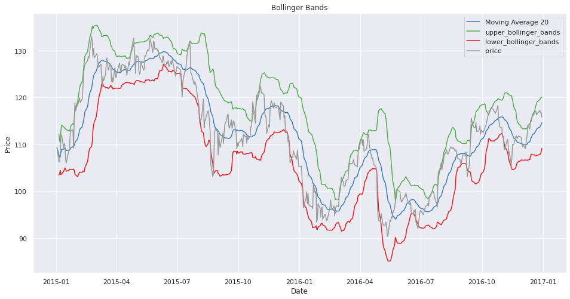
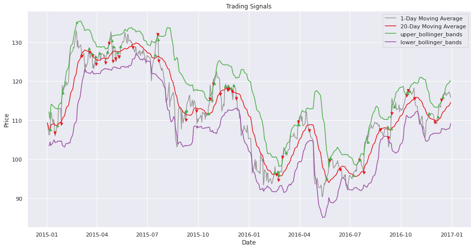
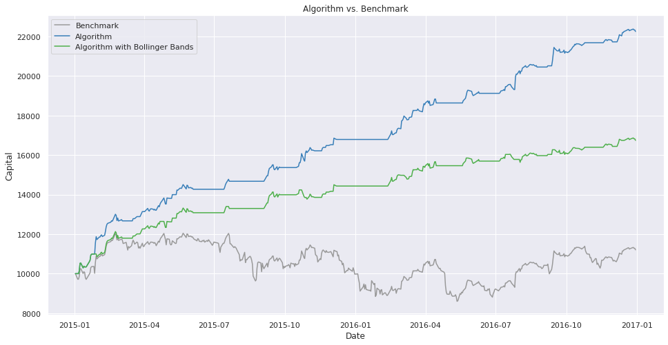

### Buy and sell strategy: MA-20
### Risk Control Method: Bollinger Bands

1. Import libs and stock info files
2. Run this to get results (use AAPL as an example)
```
company = nyse[nyse['symbol'] == 'AAPL'].set_index('date')
company, signals = run_strategy(company)
bollinger_bands_visualization(company, signals=signals) # show bollinger_bands
trading_visualization(company, signals=signals) # show when to trade
return_visualization(company, signals=signals) # show the final return
show_final_return_results(signals=signals) # show the numerical final return
show_sharpe_ratio_results(signals=signals) # show the sharpe ratio
```
3. Here is the in-sample result:







```
Benchmark: 24618.48821624455
Return: 48196.056722856236
Return with Bollinger Bands: 34503.23349582836

Benchmark sharpe ratio: 0.9248691209442815
basic sharpe ratio: 3.599122094371577
Bollinger Bands sharpe ratio: 2.6406772257658715
```







```
Benchmark: 11205.01934913777
Return: 22252.96509964892
Return with Bollinger Bands: 16743.57125956416

Benchmark sharpe ratio: 0.11624238341599169
basic sharpe ratio: 3.6424935181767077
Bollinger Bands sharpe ratio: 2.4722410802149977
```